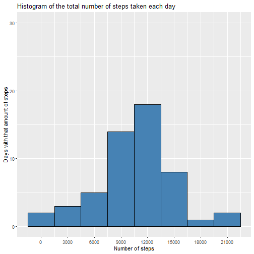
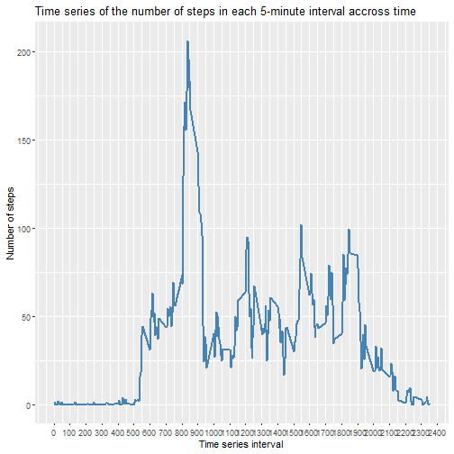
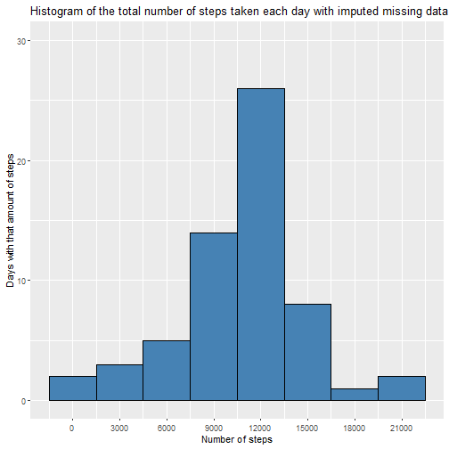
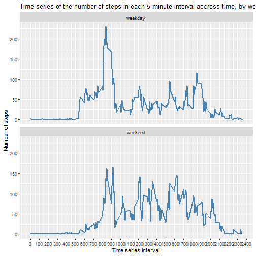

# Reproducible research: Course Project 1

## Loading and preprocessing the data

1. Load the data


```r
# To avoid version warnings 

options(scipen=999)

# Load libraries
library(data.table)
library(ggplot2)

# Set working directory and read data
setwd("D:/OneDrive - Rafael Posada Velázquez/OneDrive/00. Cursos tomados/01. Data Science/5. Reproducible research/Assignment1")
DF<-fread("activity.csv")
```


2. Process/transform the data (if necessary) into a format suitable for your analysis


```r
DF.clean <- DF[complete.cases(DF), ] #To use without NA
```


## Total number of steps taken each day

1. Make a histogram of the total number of steps taken each day


```r
stepsEachDay<-aggregate(steps ~ date, DF.clean, FUN="sum")


ggplot()+
    geom_histogram(data=stepsEachDay,aes(steps),binwidth = 3000,color="black",fill = "steelblue")+
    labs(title="Histogram of the total number of steps taken each day",
         x ="Number of steps", y = "Days with that amount of steps")+
    ylim(0,30)+ scale_x_continuous(breaks=seq(0, 25000, 3000))
```



2. Calculate and report the **mean** and **median** total number of steps taken per day


```r
Mean <- round(mean(stepsEachDay$steps,na.rm = T),2)

Median <- median(stepsEachDay$steps,na.rm = T)

# Report using `r Mean` and `r Median`
```

The **mean** is 10766.19 and the **median** is 10765

## Average daily activity pattern

1. Time series plot of the 5-minute interval (x-axis) and the average number of steps taken, averaged across all days (y-axis)


```r
stepsEachInterval <- aggregate(steps ~ interval, DF, FUN="mean")

ggplot()+
    geom_line(data=stepsEachInterval,aes(interval,steps),linewidth = 1,color ="steelblue")+ 
    scale_x_continuous(breaks=seq(0, 2400, 100))+
    labs(title="Time series of the number of steps in each 5-minute interval accross time",x ="Time series interval", y = "Number of steps")
```




2. 5-minute interval that on average across all the days has the maximum number of steps?


```r
Interval<-max(stepsEachInterval$interval)
Steps<-round(max(stepsEachInterval$steps),1)

# Report using `r Interval` and `r Steps`
```

The 2355 interval has the maximum numer of steps with 206.2 on average each day 

## Imputing missing values

1. Calculate and report the total number of missing values in the data set. 


```r
MissingValues <- sum(is.na(DF$steps))

# Report using `r MissingValues`
```

The number of missing values in the data set is 2304.


2. Devise a strategy for filling in all of the missing values in the dataset. The strategy does not need to be sophisticated. For example, you could use the mean/median for that day, or the mean for that 5-minute interval, etc.


```r
# Vector of values to impute
stepsEachIntervalPerDay<-rep(stepsEachInterval$steps,61)
SubstitutionVector<-stepsEachIntervalPerDay[is.na(DF$steps)]

# Create a vector to fill in with imputed values
steps.completed<-DF$steps 

# Filter the NA and substitute with the corresponding value of the substitution vector
steps.completed[is.na(steps.completed)]<-SubstitutionVector
```

3. Create a new data set that is equal to the original data set but with the missing data filled in.


```r
DF.complete <- DF
DF.complete$steps <- steps.completed
```

4. Make a histogram of the total number of steps taken each day and calculate and report the mean and median total number of steps taken per day. Do these values differ from the estimates from the first part of the assignment? What is the impact of imputing missing data on the estimates of the total daily number of steps?

First we make the histogram of the total number of steps taken each day with imputed missing data


```r
stepsEachDayComplete<-aggregate(steps ~ date, DF.complete, FUN="sum")

ggplot()+
  geom_histogram(data=stepsEachDayComplete,aes(steps),binwidth = 3000,color="black",fill ="steelblue")+
  labs(title="Histogram of the total number of steps taken each day with imputed missing data",
       x ="Number of steps", y = "Days with that amount of steps")+
  ylim(0,30)+ scale_x_continuous(breaks=seq(0, 25000, 3000))
```



2. Calculate and report the **mean** and **median** total number of steps taken per day with imputed missing values


```r
MeanCompleted <- round(mean(stepsEachDayComplete$steps,na.rm = T),2)

MedianCompleted <- median(stepsEachDayComplete$steps,na.rm = T)

# Report using `r MeanCompleted` and `r MedianCompleted`
```

Once the missing values have been imputed with the interval average number of steps, the **mean** is 10766.19 and the **median** is 10766.1886792. While the mean is the same, the median changed to be equal to the mean, given that the days with only NAs where substituted with the mean.

## Differences in activity patterns between weekdays and weekends?

1. Create a new factor variable in the dataset with two levels – “weekday” and “weekend” indicating whether a given date is a weekday or weekend day.


```r
DF.complete$DayofWeek<-weekdays(DF$date)

DF.complete$Weekend<- ifelse(
          DF.complete$DayofWeek=="sábado"| DF.complete$DayofWeek=="domingo"| 
          DF.complete$DayofWeek=="saturday"| DF.complete$DayofWeek=="sunday",
          "weekend","weekday")
DF.complete$DayofWeek<-factor(DF.complete$DayofWeek)
DF.complete$Weekend<-factor(DF.complete$Weekend)
```


Finally this is a plot containing a time series plot of the 5-minute interval (x-axis) and the average number of steps taken, averaged across all weekday days on one panel and weekend days on the other panel (y-axis).


```r
stepsEachInterval <- aggregate(steps ~ interval + Weekend, DF.complete, FUN="mean")

ggplot()+
    geom_line(data=stepsEachInterval,aes(interval,steps),linewidth = 1,color ="steelblue")+ 
    scale_x_continuous(breaks=seq(0, 2400, 100))+
    labs(title="Time series of the number of steps in each 5-minute interval accross time, by weekday",x ="Time series interval", y = "Number of steps") + facet_wrap( Weekend ~ ., nrow=2)
```


